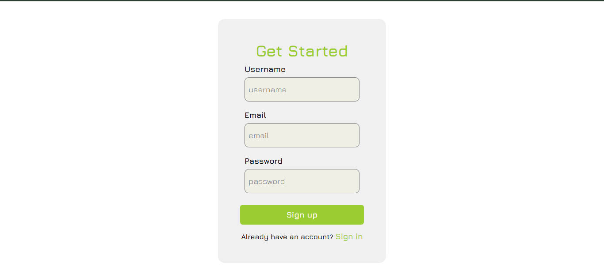
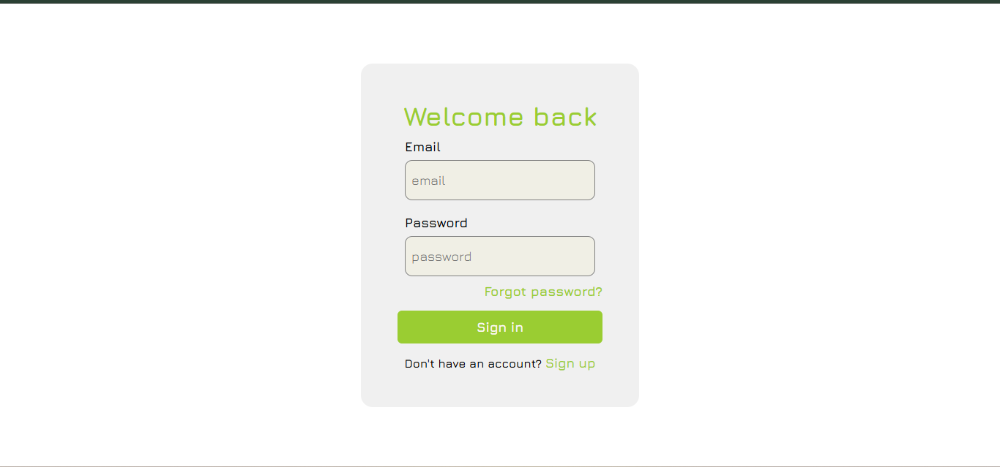
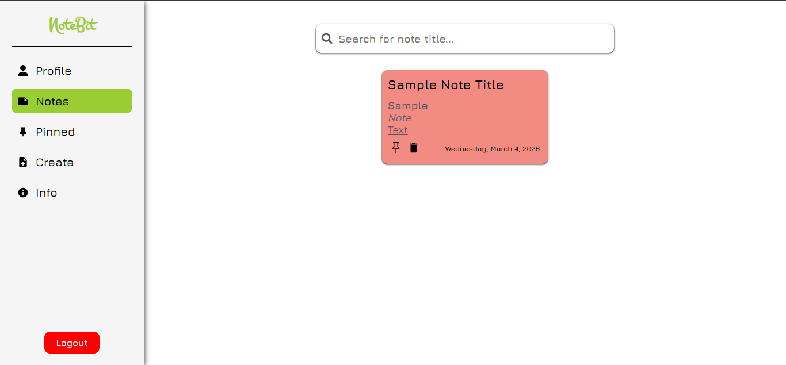
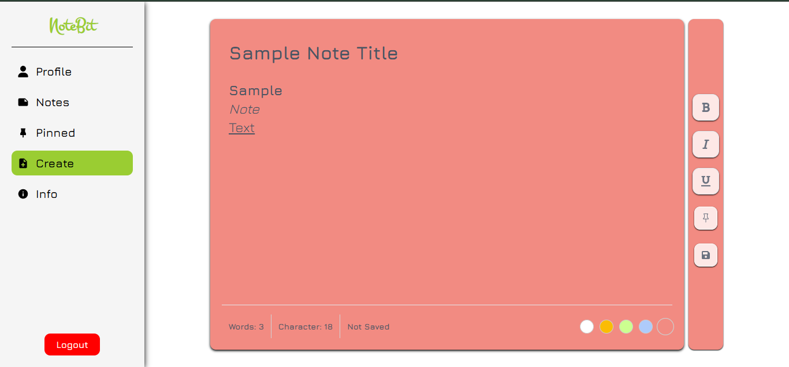
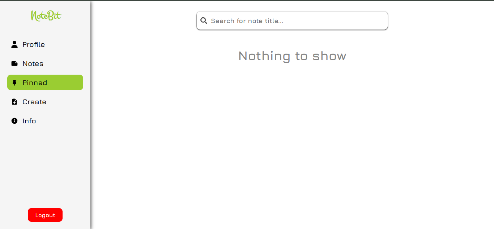

# Notes App

A full-stack notes management application where users can create, manage, and organize their personal notes.  
The application provides rich text formatting, note pinning, search functionality, and the ability to export notes.

## Deployed Link
http://note-bit.vercel.app/

## Tech Stack

Frontend
- React.js
- JavaScript
- HTML
- CSS

Backend
- Node.js
- Express.js

Database
- SQLite

Tools
- REST APIs
- Postman

---

## Features

### User Features
- User registration and login
- User profile with basic details
- View total notes and pinned notes
- Export notes as `.txt` file

### Notes Management
- Create notes
- View all notes in dashboard
- Search notes by title
- Pin important notes

### Editor Features
- Bold text
- Italic text
- Underline text
- Change note background color

---

## Screenshots

### Create Account Page


### Login Page


### Dashboard


### Create Note


### Profile Page


---

## Setup Instructions

### Clone the repository

```
git clone https://github.com/suraj-tetarwal/NoteBit.git
```

### Backend Setup

```
cd backend
npm install
node server.js
```

### Frontend Setuo

```
cd frontend
npm install
npm start
```

## Author

Suraj Tetarwal

Full stack/backend developer
